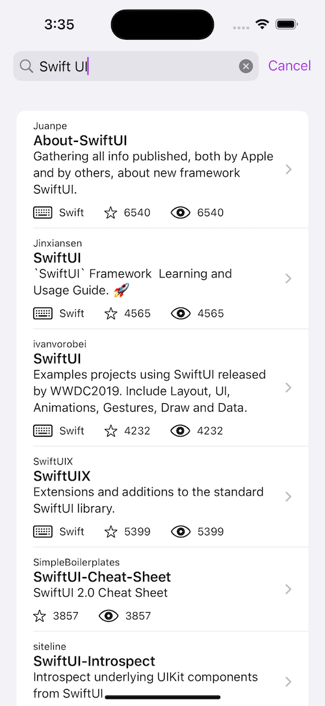

# GitHub Search 🔎

## Features

- Permits simple repositories search using the GitHub REST API

## General approach

- 100% Swift.
- Uses Swift UI for interface development.
- Uses Combine to handle API requests.
- Uses simple MVVM architecture pattern.
- Prefers functionality based in protocol composition over inheritance.

## Considerations and Pitfalls
- GitHub token expires in 30 days.
- API limits functionality to up to 30 requests per minute.
- This is a roughly 3 day work, have this in mind.
- Misses strings localization 🗣️.
- **Lack** of Unit Test 😪, however, mock data is provided for previews.
- No UI tests.

## Patterns
- Define a simple `RequestPerforming` interface to handle requests, a concrete implementation is created to perform the tasks using `Combine` and `URLSession`.
- Define an `APIClient` interface to handle the specific API requests, mock and concrete implementations are created to fetch data from the specific endpoints, in this case, the `/search/repositories`.
- All API endpoints are handled by using a simple `APIResource` interface, mock and concrete implementations are created for the required scenarios (actual HTTP resources and local files for mock data).
- Taking advantage **Swift UI**, a simple `ViewModel` is used to handle published data to control the states in the declarative interface provided, data binding is used to control the screen updates after a data update.
- Simple dependency injection of properties is used, to pass the required data where needed.

## Model Layer
- `Struct`s mostly used, conforming to `Decodable` and `Identifiable` where needed, for SwiftUI `ForEach` handling.
- Using nested definitions for namespace correctness where needed.

## Dependencies
- While there are no actual dependencies used in the app functionalities, due to the scope in the project, and because the GitHub access token is needed, a simple cyphered secret is embedded in the code. However, the token was created using [Arkana][arkana].

##

Thank you for reading!

## About

Author: [**Victor Soto**][vs]

Last Revision: 09-03-23

[vs]: https://www.victorso.to
[arkana]: https://github.com/rogerluan/arkana
